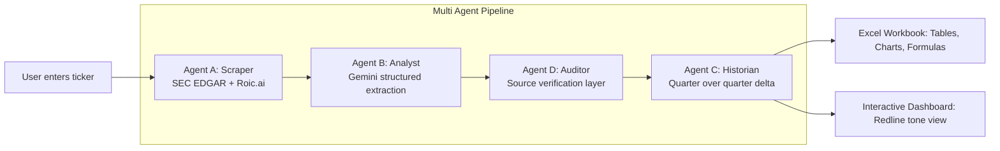

# Earnings-sentinel[README.md](https://github.com/user-attachments/files/32264060/README.md)
[Uploading README.md…]()
<div align="center">

# Earnings Sentinel

### AI Powered Equity Research Automation

[](https://www.python.org/)
[](https://fastapi.tiangolo.com/)
[](https://ai.google.dev/)
[](https://render.com/)
[](LICENSE)

[How It Works](#how-it-works) · [Architecture](#architecture) · [Getting Started](#getting-started)

</div>

## Overview

Earnings Sentinel is an autonomous, multi agent research pipeline that reads a public company's latest earnings call transcript and SEC filing, and turns them into a structured, audited, investor ready analysis.

Enter a ticker. Four coordinated agents ingest the primary sources, extract quantitative guidance and qualitative tone signals, verify every claim against the raw source text, and compare the results against the prior quarter. The output is a formatted Excel workbook and an interactive dashboard.

The system is built around a specific problem in equity research: earnings calls generate more language and more numbers than an analyst can fully absorb quarter over quarter, and the signal that actually matters, a subtle hedge, a dropped guidance line, an evasive answer, is easy to miss. Earnings Sentinel is built to catch that.

## Why This Exists

Every public company earnings call follows the same shape: a script of results, a script of guidance, then an unscripted Q&A where analysts probe for what management didn't say in the prepared remarks. The information that actually moves a thesis often lives in the gap between the two:

- Did guidance actually get raised, or does it just sound that way?
- Did management's language get more hedged on a topic they were confident about last quarter?
- Did an analyst get a straight answer, or a redirect?
- Are these claims actually in the transcript, or is this a hallucination?

Earnings Sentinel is designed to answer all four, for any US listed company, every quarter.

## Architecture

Earnings Sentinel is built as four coordinated agents, each with a single responsibility, run in a deterministic sequence rather than an open ended agent framework. This is a deliberate design choice for reliability and auditability.



| Agent | Role | What it does |
|---|---|---|
| A: Scraper | Data ingestion | Pulls the latest earnings call transcript (Roic.ai API) and the most recent 10-Q filing (SEC EDGAR official submissions API, no scraping, no guessed endpoints) |
| B: Analyst | Structured extraction | Sends the transcript to Gemini with a strict JSON schema, extracting three categories: quantitative guidance, linguistic drift (hedging language), and Q&A friction (evasive or defensive answers) |
| D: Auditor | Hallucination guard | Deterministically fuzzy matches every quoted claim and named analyst back against the raw transcript text. Not another LLM call, a text verification pass that flags anything it can't confirm |
| C: Historian | Longitudinal analysis | Compares this quarter's structured output against the prior quarter's, classifying every guidance line as Raised, Lowered, Maintained, New, or Dropped, and tracking which points of analyst friction are new, resolved, or recurring |

## Key Features

**Structured, schema enforced extraction.** Every transcript is parsed into strict JSON, not free text summarization, so the output is queryable, chartable, and consistent across companies and quarters.

**Built in hallucination auditing.** Every quote and every named analyst is checked against the source transcript with deterministic fuzzy string matching before it reaches the report, with a visible pass rate score.

**Investor aware signal classification.** Guidance changes aren't colored by raw direction, they're classified by actual investor impact. Raised revenue guidance is favorable. Raised operating expense guidance is not.

**Redline style language drift tracking.** Tone shifts are rendered like a tracked changes document, struck through prior language and highlighted current language, since the product's core insight is language changing over time.

**Quant grade Excel output.** Multi sheet workbooks with real Excel Tables, native charts (guidance shift, revenue breakdown, friction and tone distribution), parsed numeric columns rather than display text only, and working formulas that recalculate instead of hardcoded values.

**Two ways to run it.**
1. Google Colab notebook: full pipeline with an embedded interactive UI, persistent history via Google Drive
2. Live web app: FastAPI backend and standalone dashboard, deployed publicly, server side API key management, per visitor rate limiting

**Quarter over quarter memory.** Every analysis is saved and indexed by ticker and quarter, so the Historian agent always has a prior period to compare against once a second quarter has been run.

## Tech Stack

| Layer | Technology |
|---|---|
| LLM / Analysis Engine | Google Gemini (gemini-flash-latest), structured JSON output mode |
| Filing Data | SEC EDGAR (official data.sec.gov submissions API) |
| Transcript Data | Roic.ai Earnings Call Transcripts API |
| Backend (Web) | FastAPI, Uvicorn |
| Backend (Notebook) | Google Colab, google.colab.output JS/Python bridge |
| Report Generation | pandas, openpyxl (native charts, Excel Tables, formulas) |
| Frontend | Hand built HTML/CSS/JS, no framework dependency |
| Hosting | Render (Blueprint deploy, render.yaml) |


## How It Works

1. You type a ticker into the live dashboard or the notebook's interactive cell.
2. Agent A resolves the ticker to a SEC CIK, pulls the latest 10-Q, and fetches the most recent earnings call transcript.
3. Agent B sends the transcript through a schema constrained Gemini call, returning strict JSON across three signal categories.
4. Agent D independently checks every quote and analyst name against the raw transcript text and produces a pass rate score.
5. Agent C loads the prior quarter's saved analysis (fetching and analyzing it on the fly if it doesn't exist yet) and runs a second Gemini call to compare the two, matching metrics and topics by meaning rather than exact text.
6. The output layer builds a formatted Excel workbook and a standalone HTML dashboard from the same underlying data.

## Getting Started

### Option 1: Run it yourself

```bash
git clone https://github.com/<your-username>/earnings-sentinel.git
cd earnings-sentinel
pip install -r requirements.txt

export GEMINI_API_KEY=your_key
export ROIC_API_KEY=your_key
export SEC_USER_AGENT="EarningsSentinel your_email@example.com"

uvicorn app:app --reload

**Run Python code @Colab_Code_For_Execution
```


### Option 2: Deploy your own copy (Render)
1. Fork this repo
2. On Render: New, then Blueprint, then connect your fork
3. Add your GEMINI_API_KEY, ROIC_API_KEY, and SEC_USER_AGENT as environment variables in the Render dashboard
4. Deploy. Render reads render.yaml automatically and provisions everything

## Project Structure

```
earnings-sentinel/
├── pipeline.py        Core multi agent pipeline (Agents A-D and report builders)
├── app.py              FastAPI web server, rate limiting, API endpoint
├── static/
│   └── index.html      Interactive front end dashboard
├── requirements.txt
├── render.yaml          One click deploy configuration
└── README.md
```

## Current Constraints

- Transcript coverage depends on your Roic.ai plan tier. The free tier may only guarantee certain tickers. SEC filing data works for any US listed company regardless.
- Free tier hosting sleeps after periods of inactivity. The first request after idle time can take up to a minute to wake the server, on top of normal pipeline runtime.
- History persistence differs by deployment mode. The Colab version stores results in Google Drive. The web deployment currently stores on local disk, which resets on redeploy.

## Roadmap

- [ ] Persistent, database backed history for the web deployment
- [ ] Multi provider transcript sourcing to reduce single vendor coverage dependency
- [ ] Batch mode: generate reports for an entire watchlist in one run
- [ ] Sector and peer relative context for tone and guidance shifts
- [ ] Slack/webhook alerting for flagged guidance changes on a saved watchlist
- [ ] Expanded auditor: cross checking guidance figures directly against XBRL tagged data in the filing

## Contributing

Issues and pull requests are welcome. New agents should follow the existing pattern: one clear responsibility, explicit inputs and outputs.

## License

MIT. See LICENSE for details.

## Author

Built by [Abhyudaya Dwivedi]. Connect on https://www.linkedin.com/in/abhyudaya-dwivedi-730739273/

---

<div align="center">
<sub>Earnings Sentinel is a research and educational tool. It is not investment advice. All figures are AI extracted from public disclosures and independently source verified, but should be cross checked against primary filings before being used to inform investment decisions.</sub>
</div>
